# ObjC-Swift 混编在模块化/组件化项目中的实践

**关键词**：模块化/组件化、ObjC-Swift 混编、Swift 静态库、ABI Stability、Module Stability、LLVM Module、Umbrella Header

## 目录
- 基础准备工作
  - 在一个 App Target 内部混编
  - 在一个 Framework Target 中混编
- 踩坑之旅
  - 项目背景
  - 静态库子工程的集成
  - 静态链接问题
  - 动态链接问题
  - ABI Stability 和`Always Embed Swift Standard Library` 选项
  - 当模块化/组件化项目遇到 Swift 静态库
    - ObjC 模块调用 Swift 模块
    - Swift 模块调用 Swift 模块
    - Module Stability
    - Swift 模块调用 ObjC 模块
    - LLVM Module 和 Umbrella Header
  - 调试问题
- 总结


## 一、基础准备工作

在正式开始实践 Swift-ObjC 混编之前，我们有一些问题是绕不过去的，比如：

- Swift 和 ObjC 混编，我们怎么开始？官方文档有相关的介绍吗？
- 在模块化/组件化的项目中，Swift 和 ObjC 怎么混编？
- 业界中已经开始 Swift-ObjC 混编的项目，他们是怎么做的？
- 我们的现状如何，针对这些已有的经验需要做哪些考量？我们应该怎么做？
- 如果在现有的 ObjC 项目中引入 Swift，会带来哪些影响？在哪些方面会有限制？
- ...

在 Apple 的[官方文档](https://developer.apple.com/documentation/swift#2984801)中有关于 Language Interoperability 的详细介绍，主要是从 ObjC 迁移到 Swift 的角度来描述的，总结下来主要是以下三点：

- 如何调整项目中现有的 ObjC 和 C 代码的 API，以提供给 Swift 调用，比如添加 nullability 相关的宏和关键字，添加 Swift API 别名等等
- 各种基础数据类型在 Cocoa Framework 与 Swift 之间的转换关系
- 如何在 Swift 代码中调用 ObjC 代码，以及如何在 ObjC 代码中调用 Swift 代码


这里我们重点关注的是**如何实现 Swift 代码和 ObjC 代码的相互调用**。

#### 1. 在一个 App Target 内部混编

如果是在一个 App Target 内部混编的话，当我们在 ObjC 项目中新建 Swift 文件时或者在 Swift 项目中新建 ObjC 文件时，Xcode 都会自动帮你新建一个 `Objective-C bridging header file`（当然我们也可以手动创建），我们可以在这个文件中导入需要暴露给 Swift 代码调用的 ObjC 头文件，这样我们就能在 Swift 中调用 ObjC 的代码了。


图 1 Objective-C bridging header 文件的创建


图 2 在 Swift 中调用 ObjC 的代码

如果我们想在 ObjC 代码中调用 Swift 的代码，只需要写上一行 `import "ProductModuleName-Swift.h"`（这里的 `ProductModuleName`表示 target 的名字）就可以了，因为在编译时，编译器会自动给项目中的 Swift 代码生成一个 `ProductModuleName-Swift.h` 的头文件（这个文件是编译产物，我们在 build 目录可以看到它），暴露给 ObjC 使用。


图 3 在 ObjC 中调用 Swift 的代码

#### 2. 在一个 Framework Target 中混编

除了在一个 App Target 内部混编之外，还有一种情况是当我们要写一个 Library 或者 Framework 给别人用时，这个时候如果有 ObjC 和 Swift 的混编，Objective-C bridging header 的方式已经不适用了，如果我们用了这个头文件，Xcode 在预编译时也会警告我们。

先来看看 Swift 怎么调用 ObjC，正确的做法是将 Build Settings 中的 Defines Module 选项设置为 `YES`，
然后新建一个 umbrella header，再将需要暴露给（内部的） Swift 调用的 ObjC 的头文件在这个 umbrella header 中导入（LLVM Module 和 umbrella header 是两个新概念，后面会做具体介绍）。


如果要想在 ObjC 调用 Swift，同样也要将 Build Settings 中的 Defines Module 选项设置为 `YES`，然后在要引用 Swift 代码的 ObjC 文件中导入编译器生成的头文件 `#import <ProductName/ProductModuleName-Swift.h>`。

#### 参考
- https://developer.apple.com/documentation/swift#2984801

## 二、踩坑之旅

### 1. 项目背景


```
--------------------------------------------------     
              Hotel | HotelChat | ...                    业务层
--------------------------------------------------
      HotelFoundation | HotelContracts | ...           业务基础层
--------------------------------------------------
  Network | Foundation | MapKit | RNKit | ...          基础框架层
--------------------------------------------------
 
```

图 4 笔者所在公司 iOS 客户端架构示意图（以酒店的业务为例）

目前笔者所在公司的项目整体架构是采用模块化设计的，而且整个项目完全都是使用 ObjC/C 实现的，在实际开发时，各模块既可以以源码的形式使用，也可以以`.a + .h + 资源 bundle` 的形式使用，简而言之，既可以源码依赖，也可以是静态库依赖。那么我们可以直接在项目中使用 Swift 静态库吗？

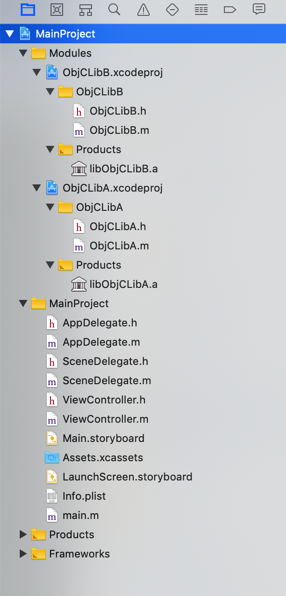

图 5 项目结构示意图（简化模型）

我们都知道，从 Xcode 9 开始，Apple 就开始支持 Swift 静态库的使用了，所以我们现有的项目架构并不需要调整，引入 Swift 代码的话是可以以静态库的形式出现的。


### 2. 静态库子工程的集成

我们要做的第一步，就是创建一个 Swift 静态库工程，然后再把它作为子工程集成到 ObjC 主工程中去。

大概的步骤如下：

- 创建 Swift 静态库工程（这里我们给它取个名字，叫 `SwiftLibA`，主工程叫 `MainProject`）
- 在主工程中集成 Swift 静态库工程
  - 添加子工程：将 Swift 静态库工程的 xcodeproj 文件拖到主工程中 
  - 添加构建依赖：在 Build Phases 面板的 `Dependencies` 中添加这个静态库的 target 为构建依赖
  - 添加要链接的静态库：在 Build Phases 面板的 `Link Binary With Libraries` 中链接这个 Swift 静态库 
  - 导出 `xxx-Swift` 头文件：在 Swift 静态库工程的 `Run Script Phase` 中添加脚本，将编译器生成的 `SwiftLibA-Swift` 头文件复制到 build 目录下（如图 6 所示）
- 在 ObjC 代码中调用 Swift API
  - 在 Swift 代码中添加 `@objc`、`public` 等关键字
  - 在 ObjC 代码中添加 `#import <SwiftLibA/SwiftLibA-Swift.h>`（这里的 SwiftLibA 是新添加的静态库的名字）


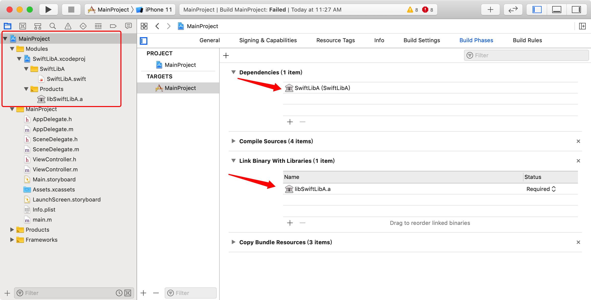
图 6 在主工程中集成 Swift 静态库工程


图 7 复制 `xxx-Swift` 头文件到 build 目录下


**示例代码**：

```Swift
@objcMembers
public class SwiftLibA: NSObject {
    public func sayHello() {
        print("Hello, this is Swift world!")
    }
}

```

```Objective-C
@implementation ViewController

- (void)viewDidLoad {
    [super viewDidLoad];
    
    [[SwiftLibA new] sayHello];
}

@end
```

**问题:**

1.为什么需要设置 `Dependencies`？

设置 `Dependencies` 是为了告诉 Xcode build system 在编译主工程之前，需要先编译哪些其他的 target，简而言之，就是编译依赖。

2.为什么需要设置 `Link Binary With Libraries`？

Xcode 在 build 主工程时，会先编译好各个子工程，最后再链接成一个可执行文件，通过这个 `Link Binary With Libraries` 设置，我们可以指定需要参与链接的静态库。

3.为什么需要复制 `xxx-Swift` 头文件到 build 目录下？

因为编译时自动生成的头文件是在 `Intermediates` 目录中各子工程所属的 `DerivedSources` 中，比如在我的电脑上就是 `/Users/ShannonChen/Library/Developer/Xcode/DerivedData/MainProject-aptbbpsumoitdlhbzjckyglkspoi/Build/Intermediates.noindex/SwiftLibA.build/Debug-iphonesimulator/SwiftLibA.build/DerivedSources/SwiftLibA-Swift.h`，而主工程在编译时会到 `Build` 目录下的 `Products` 目录去找头文件，在我的电脑上就是 `/Users/ShannonChen/Library/Developer/Xcode/DerivedData/MainProject-aptbbpsumoitdlhbzjckyglkspoi/Build/Products/Debug-iphonesimulator/include`，所以主工程或者其他子工程在编译时就找不到这个头文件了。

因此，我们就需要把这个 `xxx-Swift` 头文件复制到 build 目录下，具体脚本内容如下:

```shell
# 将编译器生成的 xxx-Swift 头文件拷贝到 build 目录下的 include 目录中
include_dir=${BUILT_PRODUCTS_DIR}/include/${PRODUCT_MODULE_NAME}/
mkdir -p ${include_dir}
cp ${DERIVED_SOURCES_DIR}/*-Swift.h ${include_dir}
```

**参考：**

- https://paul-samuels.com/blog/2018/01/14/swift-static-library-in-objective-c/

### 3. 静态链接问题

集成好 Swift 静态库之后，我们再 build 一下，发现在链接时仍然会报错。


图 8 静态链接时报错

根据报错信息来看，是因为找不到 `swiftFoundation` 这些动态库，这是由于我们的主工程是纯 ObjC 项目，所以我们需要告诉 Xcode build system 这些 Swift 动态库的路径。

在 `Build Settings` tab 下`找到 Library Search Paths`，添加上 `$(TOOLCHAIN_DIR)/usr/lib/swift/$(PLATFORM_NAME)`，另外还需要添加 Swift 5.0 的动态库所在的路径 `$(TOOLCHAIN_DIR)/usr/lib/swift-5.0/$(PLATFORM_NAME)`。

这两个目录都可以在我们的电脑上看到：

- `/Applications/Xcode.app/Contents/Developer/Toolchains/XcodeDefault.xctoolchain/usr/lib/swift/iphoneos`
- `/Applications/Xcode.app/Contents/Developer/Toolchains/XcodeDefault.xctoolchain/usr/lib/swift-5.0/iphoneos`


图 9 Swift 标准库

**参考：**

- https://stackoverflow.com/a/53101587
- https://stackoverflow.com/a/57126566


### 4. 动态链接问题

静态链接的问题已经解决了，此时按下 `⌘+R`，模拟器启动后发生崩溃。控制台上的日志信息显示 `dyld: Library not loaded: @rpath/libswiftCore.dylib`，这是因为程序启动时 Swift 动态库加载失败了。


图 10 程序启动时发生崩溃


为了解决这个问题，我们需要设置两个地方（只要你的项目 `iOS Deployment Target` 是 12.2 以下，这两个就都需要设置）：

- 针对 iOS 12.2 及以后的系统，需要在 `Build Settings` tab 下的 `Runpath Search Path` 中最前面添加 `/usr/lib/swift`。
- 针对 iOS 12.2 以前的系统，需要将 `Build Settings` tab 下的 `Always Embed Swift Standard Libraries` 设置为 `YES`。

为什么我们要分别针对 iOS 12.2 之前和之后的系统做不同的设置呢？将 `Always Embed Swift Standard Libraries` 设置为 `YES` 是不是意味着每次打包时都会把 Swift 标准库打进去呢？


**参考：**

- https://stackoverflow.com/a/55392717
- https://stackoverflow.com/a/26949219

  
### 5. ABI Stability 和 `Always Embed Swift Standard Library` 选项

2019 年对 iOS 开发者来说，最大的新闻莫过于 Swift ABI 终于稳定了。ABI Stability 意味着什么呢？ABI Stability 也就是 binary 接口稳定，在运行的时候只要是用 Swift 5.0 或更高版本的编译器（Swift 5.0 对应 Xcode 10.2）构建出来的 app，就可以跑在任意的 Swift 5.0 或更高版本的 Swift runtime 上了。这样，我们就不需要像以往那样每次打一个新的 app 时都要带上一套 Swift runtime 和 standard library 了，iOS 和 macOS 系统里就会内置一套 Swift runtime 和 standard library。


图 11 在这个例子中，基于 Swift 5.0 构建出来的 app 可以直接在内置了 Swift 5 或者 Swift 5.1，甚至 Swift 6 标准库的系统上运行

但是如果你用的是 Swift 5.0 以前版本的编译器，那么打包时还是会带上一套 Swift runtime 和 standard library。

另外，对于用 Swift 5.0 或更高版本的编译器构建出来的 app，在发布 app 时，Apple 将根据 iOS 系统创建不同的下载包。对于 iOS 12.2 及以上的系统，因为系统内置了 Swift 5 的 runtime 和 standard library，所以 app 中不再需要嵌入 Swift 的库，它们会被从 app bundle 中删掉。但是对于 iOS 12.2 以下的系统，因为系统中没有内置 Swift 5 的 runtime 和 standard library，所以打包时仍然需要带上。

理解了什么是 ABI Stability，就好理解我们前面在 `Build Settings` 所做的两个设置了。

app 在启动/运行时，会先看 app bundle 中有没有 Swift runtime，如果找不到，动态链接器 `dyld` 会到 `runpath` 路径下查找 dylib（这个 `runpath` 路径是一个系统目录路径）。所以我们针对 iOS 12.2 及以后的系统添加了 Runpath Search Path：`/usr/lib/swift`，针对 iOS 12.2 以前的系统设置了 `Always Embed Swift Standard Library`。

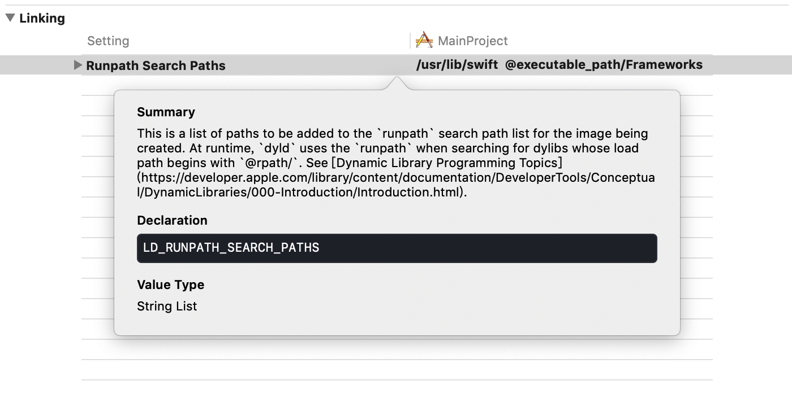
图 12 添加 Runpath Search Path


`Always Embed Swift Standard Library` 曾经叫做 `Embedded Content Contains Swift Code`，字面上看上去像是“总是嵌入 Swift 标准库”，但是实际上这里只是告诉 build system 要做的事，并不代表用户手机上下载的 app 是这样的，因为在发布 app 时，app thinning 会自动根据目标系统来决定是否将 app bundle 中的 Swift 标准库删掉。

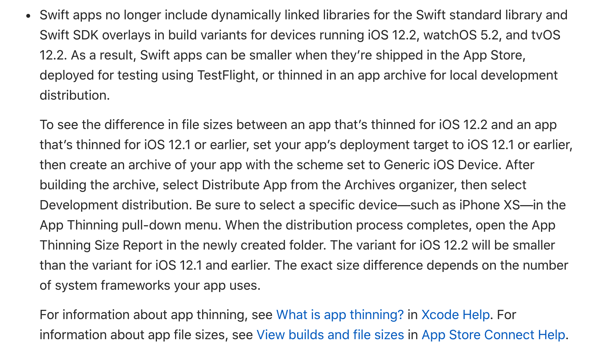
图 13 app thinning 会自动根据目标系统来决定是否将 app bundle 中的 Swift 标准库删掉

那么这个 `Always Embed Swift Standard Library` 是用来告诉 build system 做什么的呢？只要你的 target 会引用到 Swift 文件或者库，就需要把它设置为 `YES`，比如我们这里的主工程用到了 Swift 静态库，所以就需要设置为 `YES`，还有一种情况是你的 target 是一个测试工程，但是引用了 Swift 代码，那么也需要设置为 `YES`。另外，笔者试验了一下，如果给一个纯 ObjC 的项目中添加了一个 Swift 文件，Xcode 会自动将这个选项设置为 `YES`。

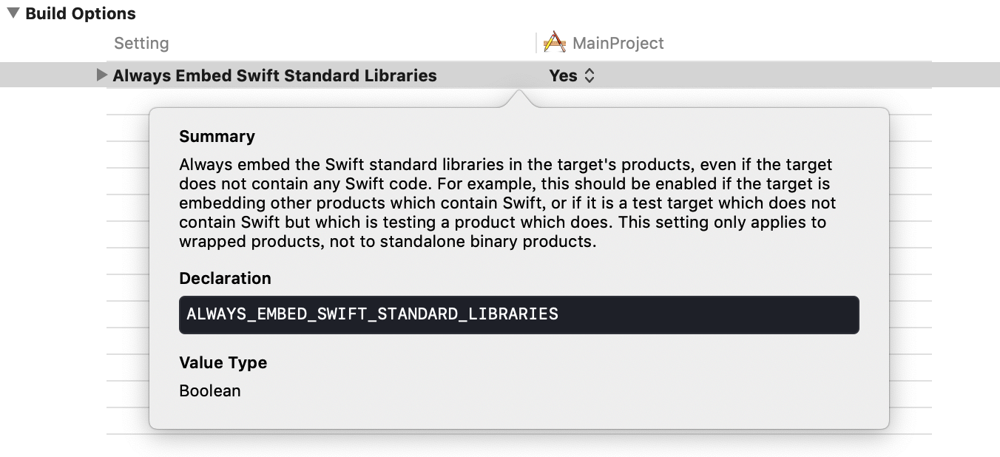
图 14 设置 `Always Embed Swift Standard Library`


**参考：**

- https://stackoverflow.com/a/55365318
- https://stackoverflow.com/a/26949219
- https://onevcat.com/2019/02/swift-abi/
- https://swift.org/blog/abi-stability-and-more/
- https://swift.org/blog/abi-stability-and-apple/
- https://developer.apple.com/documentation/xcode_release_notes/xcode_10_2_release_notes/swift_5_release_notes_for_xcode_10_2


### 6. 模块化/组件化

前面提到过，笔者所在公司的 iOS 项目是采用的是模块化架构，而模块之间是有依赖关系的。一般是上层模块依赖于下层的模块，如图 4 所示。

这里先说明一下我们这里所说的模块的概念，在我们的项目中，一个 ObjC 模块就是 `.a 静态库 + .h 头文件 + bundle 资源文件` 的组合。

#### 6.1 ObjC 模块调用 Swift 模块

如前面所说，ObjC 调用 Swift 代码时，只需要导入编译 Swift 模块时自动生成的头文件 `xxx-Swift.h` 就可以了。

比如，模块 ObjCLibA 调用模块 SwiftLibA：

```Objective-C
#import "ObjCLibA.h"
#import <SwiftLibA/SwiftLibA-Swift.h>

@implementation ObjCLibA

- (void)sayHello {
    [[SwiftLibA new] sayHelloWithName:@"ObjCLibA"];
}

@end
```

这样的确没问题，但是考虑到持续持续交付平台上各个模块都是独立编译的情况，像上面的这个例子中，如果单独编译模块 ObjCLibA 的话，就会出现头文件找不到的错误： `'SwiftLibA/SwiftLibA-Swift.h' file not found`。


图 15 模块 ObjCLibA 调用模块 SwiftLibA，(a)编译主工程没问题，(b)但是单独编译模块 ObjCLibA 就报错了


这是因为 SwiftLibA-Swift.h 文件是编译模块 SwiftLibA 时的产物，是生成在 build 目录中，而不是工程代码所在的目录中。这一点我们在前面已经讨论过，这里不再赘述。

我们都知道使用 `#import` 指令导入头文件有两种形式，`#import "xxx.h"` 和 `#import <xxx.h>`，编译器在编译 ObjC 代码时会根据不同的指令形式去搜索头文件，对于前者来说是到项目（源代码）所在目录下搜索，对于后者是到环境变量所指的目录或者指定目录下去搜索的。

所以要想解决这个问题，我们可以换个思路，这个 SwiftLibA-Swift.h 文件是根据我们写的 Swift 代码公有 API 生成的，那么我们每次修改 Swift 代码的公有 API 时，它就会更新一次，所以，我们可以在每次 build 这个模块时把最新生成的拷贝到源码所在目录下（这个文件需要加入到版本控制中和其他代码一起提交），然后再把新的路径添加到 ObjC 模块的 `Header Search Path` 中，另外，ObjC 模块中头文件导入的方式也要改成双引号的形式。

完整脚本如下：

```shell


generated_header_file=${DERIVED_SOURCES_DIR}/*-Swift.h
include_dir=${BUILT_PRODUCTS_DIR}/include/${PRODUCT_MODULE_NAME}/

# 将编译器生成的 xxx-Swift 头文件拷贝到 build 目录下的 include 目录中
mkdir -p ${include_dir}
cp ${generated_header_file} ${include_dir}

# 去掉 xxx-Swift.h 文件头部注释中的编译器的版本号
sed -i "" "s/^\/\/ Generated by Apple.*$/\/\/ Generated by Apple/g" ${generated_header_file}

# 拷贝 xxx-Swift.h 文件到工程源码目录 
header_file_in_proj=${SRCROOT}/${PROJECT}-Swift.h
needs_copy=true
if [ -f "$header_file_in_proj" ]; then
    echo "${header_file_in_proj} 已存在"
    
    new_content=$(cat ${generated_header_file})
    old_content=$(cat ${header_file_in_proj})
    if [ "$new_content" = "$old_content" ];then
        echo "文件内容一致，无需再Copy："
        echo "${generated_header_file} "
        echo "${header_file_in_proj} "

        needs_copy=false
    fi
fi

if [ "$needs_copy" = true ] ; then
    
    echo "文件内容不一致，需要Copy："
    echo "复制文件： "
    echo "${generated_header_file} "
    echo "${header_file_in_proj} "

    cp ${generated_header_file} ${header_file_in_proj}
fi

```

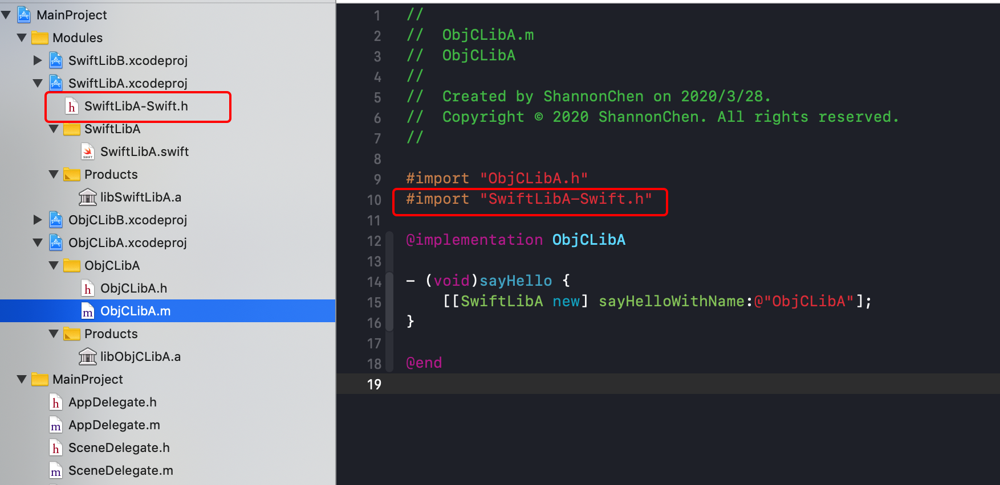
图 16 将编译器生成的头文件拷贝到源代码目录

**参考：**

- https://docs.microsoft.com/en-us/cpp/preprocessor/hash-include-directive-c-cpp?view=vs-2019

#### 6.2 Swift 模块调用 Swift 模块

ObjC 模块调用 Swift 模块的问题解决了，那么如果 Swift 模块调用 Swift 模块呢？会不会也存在类似的问题？

先来看一个例子，还是前面的那个示例项目，只不过多了一个模块 SwiftLibB：

```
- MainProject
  - ObjCLibA
  - SwiftLibA
  - SwiftLibB
```

然后我们在模块 SwiftLibA 中调用了模块 SwiftLibB 中的 API：

```Swift
import Foundation
import SwiftLibB

@objcMembers
public class SwiftLibA: NSObject {
    
    public func sayHello(name: String) {
        SwiftLibB().sayHello(name: name)
        print("Hello, this is " + name + "!")
        print("-- Printed by SwiftLibA")
    }
}

```
这个时候如果编译主工程是没问题的，但是如果单独编译模块 SwiftLibA 就会报错：`No such module 'SwiftLibB'`。

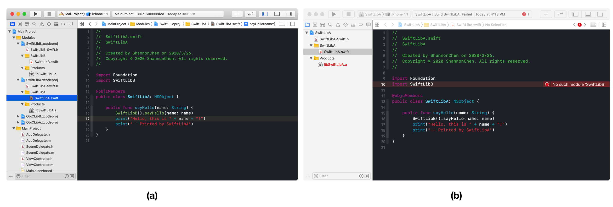
图 17 模块 SwiftLibA 调用模块 SwiftLibB，(a)编译主工程没问题，(b)但是单独编译模块 SwiftLibA 就报错了

这个问题看上去跟前面遇到的 ObjC 模块调用 Swift 模块的问题是一样的，但是我们要知道 Swift 中是没有头文件的概念的，那么 Swift 是通过什么方式暴露公开 API 的呢？

不同于 C-based 语言使用 manually-written 头文件来提供公开接口，Swift 是通过一个叫做 `swiftmodule` 的文件来描述一个 library 的 interface，这个 `swiftmodule` 文件是编译器自动生成的。我们打开 SwiftLibB 模块的 build 目录，可以看到编译器自动生成的 `SwiftLibB.swiftmodule`，这个 `SwiftLibB.swiftmodule` 目录下有两种文件：`swiftmodule` 文件和 `swiftdoc` 文件。`swiftmodule` 文件和 `swiftdoc` 文件都是二进制文件，我们可以用反编译工具查看其中的内容，`swiftmodule` 文件里面保存了模块的信息，而 `swiftdoc` 文件则保存了源代码中的注释内容。

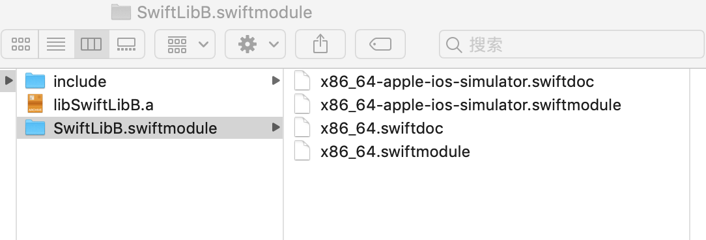
图 18 build 目录下的 swiftmodule 文件

看到这里，你可能会想我们只要像导出 `xxx-Swift.h` 文件一样，把这几个 `swiftmodule` 文件导出到源代码目录，然后再设置 SwiftLibA 的 `import path`，另外再把这几个文件加入 git 版本控制中就解决了。

是的，我一开始也是这么想的，然后我就这么去做了，单独编译 SwiftLibA 确实问题，但是提交到 git 远程仓库之后，持续交付平台上的 SwiftLibA 模块却编译报错了：

```
... error:
Module compiled with Swift 5.1 cannot be imported by the Swift 5.1.2 compiler
...
```

#### Module Stability

上面的方法之所以行不通，是因为 `swiftmodule` 文件跟编译器版本是绑定的，在 Swift 5.0 之前，Apple 官方没有提供解决办法，在发布 Swift 5.0 时，除了 ABI Stability 之外，Apple 还解决了一个重要的，就是 Module Stability，也就是我们这里遇到的问题。

ABI Stability 解决的是不同 Swift 版本的代码在**运行时**的兼容性问题，而 Module Stability 则要解决的是不同 Swift 版本的代码在**编译时**的兼容性问题。具体介绍可以看一下 Swift 官方博客 [ABI Stability and More](https://swift.org/blog/abi-stability-and-more/) 和 WWDC 2019 的视频 [Binary Frameworks in Swift](https://developer.apple.com/videos/play/wwdc2019/416/)，以及社区的讨论 [Plan for module stability](https://forums.swift.org/t/plan-for-module-stability/14551)、[Update on Module Stability and Module Interface Files](https://forums.swift.org/t/update-on-module-stability-and-module-interface-files/23337)。

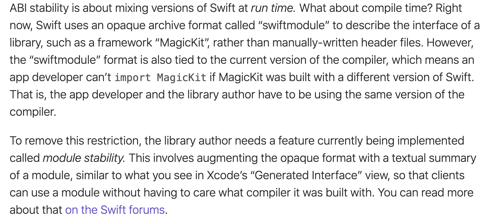
图 19 swift.org 官方博客上关于 Module Stability 的介绍

针对 Module Stability，Apple 提供的解决方案是 `swiftinterface` 文件，`swiftinterface` 文件是作为 `swiftmodule` 的一个补充，它是一个描述 module 公开接口的文本文件，不受编译器版本限制。比如，你用 Swift 5.0 的编译器编译出了一个 library，它的 `swiftinterface` 文件可以在 Swift 5.1 的编译器上使用。

我们现在打开 SwiftLibB 的 `Build Setting`，找到 `Build Options -> Build Libraries for Distribution`，把它设置为 `YES`，重新编译一下，再看看 build 目录中生成的 `SwiftLibB.swiftmodule`，里面多了几个 `swiftinterface` 文件。


图 20 `Build Libraries for Distribution` 选项


图 21 编译器自动生成的 `swiftinterface` 文件

我们可以打开 `swiftinterface` 文件跟源代码对一下，它其实就是一个 swift 头文件。

源代码：

```Swift 
import Foundation

@objcMembers
public class SwiftLibB: NSObject {

    public func sayHello(name: String) {
        print("Hello, this is " + name + "!")
        print("-- Printed by SwiftLibB")
    }
}
```

`swiftinterface` 文件中的内容：

```swiftinterface
// swift-interface-format-version: 1.0
// swift-compiler-version: Apple Swift version 5.1 (swiftlang-1100.0.270.13 clang-1100.0.33.7)
// swift-module-flags: -target x86_64-apple-ios13.0-simulator -enable-objc-interop -enable-library-evolution -swift-version 5 -enforce-exclusivity=checked -Onone -module-name SwiftLibB
import Foundation
import Swift
@objc @objcMembers public class SwiftLibB : ObjectiveC.NSObject {
  @objc public func sayHello(name: Swift.String)
  @objc override dynamic public init()
  @objc deinit
}

```

为了能够满足模块 SwiftLibA 的单独编译，跟前面对 `xx-Swift.h` 文件的操作一样，我们用脚本把 `SwiftLibB.swiftmodule` 拷贝到源代码目录中，然后再把这个新路径添加到 SwiftLibA 的 `Build Setting -> Swift Compiler-Search Paths -> Import Paths` 中。

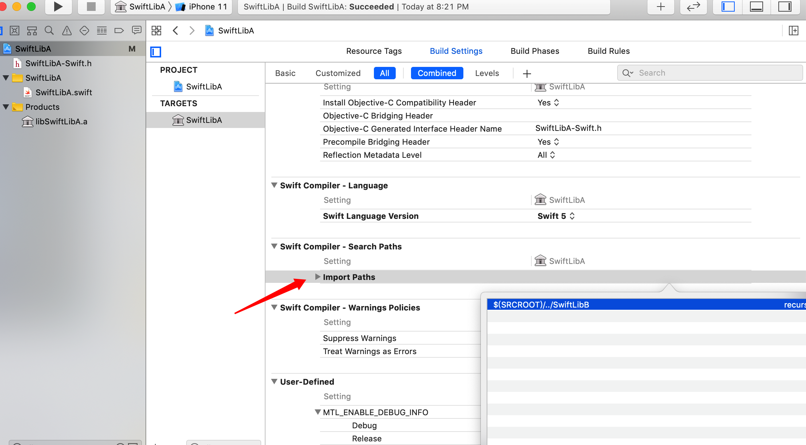
图 22 添加 swiftmodule 文件的路径到 SwiftLibA 的 import paths

这个方案对于模块化/组件化有个缺点就是，每次编译 Swift 模块时需要考虑多种不同的 CPU 架构。

除了这个方案之外，还有其他两个方案可以解决 Swift 模块之间依赖的问题：

- 我们还可以把 SwiftLibB 作为 SwiftLibA 的子工程（因为 `xcodeproj` 文件可以作为 reference 引用），然后再设置编译依赖，但不设置 `Link Binary With Libraries`，这样就能保证 SwiftLibA 编译通过，但是不会重复链接。
- 在 Swift 5 正式发布之前，还不支持 Module Stability，有 Swift 开发者用 ObjC 把 Swift 包一层，然后 ObjC 头文件作为公开接口（详见 [Swift 5 Module Stability Workaround for Binary Frameworks](https://instabug.com/blog/swift-5-module-stability-workaround-for-binary-frameworks/)）
   
**参考**

- https://medium.com/better-programming/create-swift-5-static-library-f1c7a1be3e45
- http://andelf.github.io/blog/2014/06/19/modules-for-swift/
- https://stackoverflow.com/a/58656323
- https://swift.org/blog/abi-stability-and-more/
- https://forums.swift.org/t/plan-for-module-stability/14551
- https://forums.swift.org/t/update-on-module-stability-and-module-interface-files/23337
- https://developer.apple.com/videos/play/wwdc2019/416/
- https://instabug.com/blog/swift-5-module-stability-workaround-for-binary-frameworks/
- https://medium.com/swiftify/swift-5-1-module-format-stability-best-time-migrate-objective-c-frameworks-a0434f5352a3

#### 6.3 Swift 模块调用 ObjC 模块 

如果是在同一个 app target 里，Swift 调用 ObjC 可以通过 Objective-C bridging header 来实现，但是如果是跨模块的调用呢？Swift 模块怎么调用 ObjC 模块？

根据 Apple 官方文档中的介绍，在 Library 或者 Framework 中不能使用 bridging header 的，而应该使用 umbrella header。

#### LLVM Module 和 Umbrella Header

什么是 umbrella header？这就涉及到了 LLVM Module 的概念，LLVM 引入 Module 是为了解决传统的 `#include` 和 `#import` 这些头文件导入机制所存在的问题，也就是说这是一种新的头文件管理机制，[LLVM 官方文档](https://clang.llvm.org/docs/Modules.html#problems-with-the-current-model)中对此有详细的介绍。

在 ObjC 中可以通过 `@import` 指令导入 module，在 Swift 中通过 `import` 关键字导入 module。

Module 机制中一个很重要的文件就是 module map 文件，module map 文件是用来描述头文件和 module 结构的在逻辑上的对应关系的。

> The crucial link between modules and headers is described by a module map, which describes how a collection of existing headers maps on to the (logical) structure of a module. For example, one could imagine a module `std` covering the C standard library. Each of the C standard library headers (`stdio.h`, `stdlib.h`, `math.h`, etc.) would contribute to the `std` module, by placing their respective APIs into the corresponding submodule (`std.io`, `std.lib`, `std.math`, etc.). Having a list of the headers that are part of the `std` module allows the compiler to build the `std` module as a standalone entity, and having the mapping from header names to (sub)modules allows the automatic translation of `#include` directives to module imports.
> 
> Module maps are specified as separate files (each named `module.modulemap`) alongside the headers they describe, which allows them to be added to existing software libraries without having to change the library headers themselves (in most cases [2]). 

每一个 library 都会有一个对应的 `module.modulemap` 文件，这个文件中会声明要引用的头文件，这些头文件就跟 `module.modulemap` 文件放在一起。

> The module map language describes the mapping from header files to the logical structure of modules. To enable support for using a library as a module, one must write a `module.modulemap` file for that library. The `module.modulemap` file is placed alongside the header files themselves, and is written in the module map language described below.

一个 C 标准库的 module map 文件可能就是这样的：

```
module std [system] [extern_c] {
  module assert {
    textual header "assert.h"
    header "bits/assert-decls.h"
    export *
  }

  module complex {
    header "complex.h"
    export *
  }

  module ctype {
    header "ctype.h"
    export *
  }

  module errno {
    header "errno.h"
    header "sys/errno.h"
    export *
  }

  module fenv {
    header "fenv.h"
    export *
  }

  // ...more headers follow...
}
```

modulemap 中的内容是使用 module map 语言来实现的，module map 语言中有一些保留字，其中 `umbrella` 就是用来声明 umbrella header 的。umbrella header 可以把所在目录下的所有的头文件都包含进来，这样开发者中只要导入一次就可以使用这个 library 的所有 API 了。

> A header with the `umbrella` specifier is called an umbrella header. An umbrella header includes all of the headers within its directory (and any subdirectories), and is typically used (in the `#include` world) to easily access the full API provided by a particular library. With modules, an umbrella header is a convenient shortcut that eliminates the need to write out `header` declarations for every library header. A given directory can only contain a single umbrella header.

如果你创建的是 Framework，在创建这个 Framework 时，`defines module` 默认会设置为 `YES`，编译这个 Framework 之后，可以在 build 目录下看到自动生成的 `Module` 目录，这个 `Module` 目录下有自动创建的 `modulemap` 文件，其中引用了自动创建的 umbrella header。但是如果你创建的是 static library，那就需要开发者手动为这个 module 创建 `modulemap` 文件和要引用的 umbrella header。

接下来我们创建一个 ObjCLibB 模块，然后让 SwiftLibA 模块来调用它。

首先要做的是给模块 ObjCLibB 新建一个 umbrella header 文件和一个 `modulemap` 文件，然后再把 modulemap 文件的路径添加到 SwiftLibA 的 import paths，把 umbrella header 文件的路径添加到 SwiftLibA 的 header search paths，这样就大功告成了。

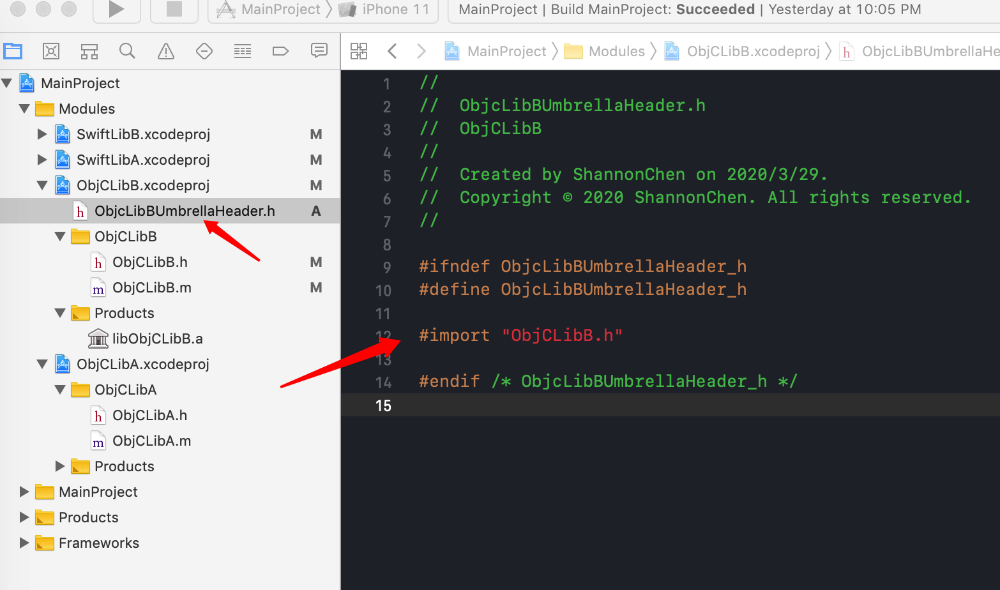
图 23 新建 umbrella header 文件

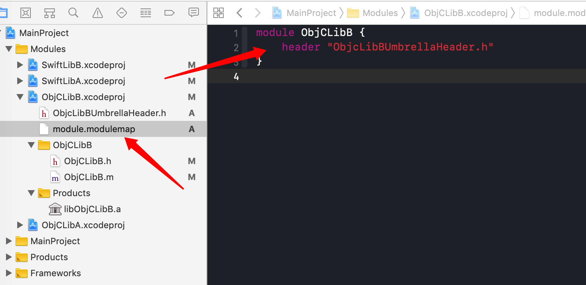
图 24 新建 modulemap 文件

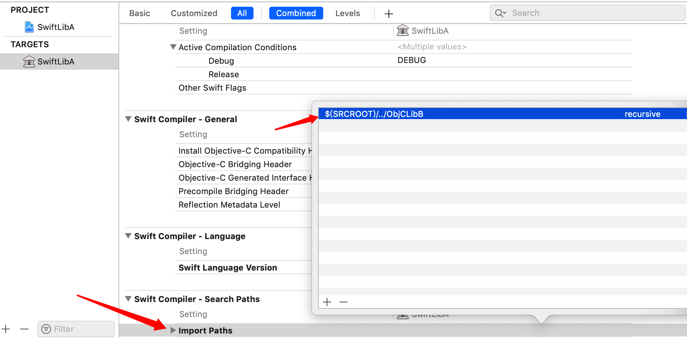
图 25 添加 modulemap 文件的路径到 SwiftLibA 的 import paths


图 26 添加 umbrella header 文件的路径到 SwiftLibA 的 header search paths

如果你的 Swift 模块要调用的模块是 ObjC-Swift 混编的，也可用同样的方式来实现，核心点就在于将 C-based 语言的头文件用 modulemap 和 umbrella header 封装起来。

**参考：**

- https://samsymons.com/blog/understanding-objective-c-modules/
- https://medium.com/swift-and-ios-writing/using-a-c-library-inside-a-swift-framework-d041d7b701d9
- https://medium.com/allatoneplace/challenges-building-a-swift-framework-d882867c97f9
- https://clang.llvm.org/docs/Modules.html
- https://hechen.xyz/post/swift-and-modules/


### 7. 调试问题

如果你的主工程是纯 ObjC 实现的，那么当你在断点调试 Swift 模块中的代码时，会无法看到变量值，即便在 console 上使用 LLDB 命令也打印不出来。

```
(lldb) po name
Cannot create Swift scratch context (couldn't load the Swift stdlib)Cannot create Swift scratch context (couldn't load the Swift stdlib)Shared Swift state for MainProject could not be initialized.
The REPL and expressions are unavailable.

```
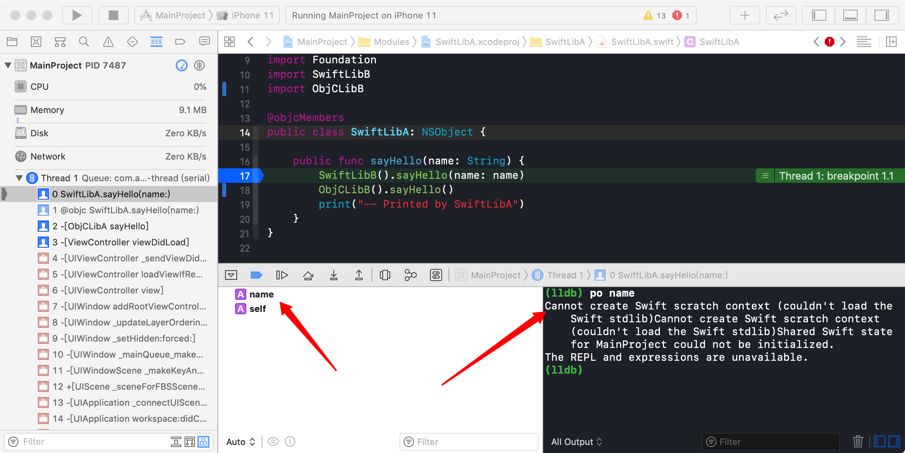
图 27 调试 Swift 代码时无法看到变量值

这是因为主工程中没有 Swift 代码，所以就没有 Swift 相关的环境和设置选项，解决办法就是在主工程中创建一个新的 Swift 文件。


## 三、总结

Swift 5 的到来终于让我们看到了期待已久的 ABI 稳定，相信更现代、更安全的 Swift 会变得越来越流行。另外，在模块化/组件化项目中落地 Swift 时，LLVM Module 是一个绕不过去的话题，LLVM Module 改变了传统 C-Based 语言的头文件机制，取而代之的是 Module 的思维。技术的发展会带来更先进的生产力，我们期待 Swift 在未来能够进一步提升我们的开发效率和编程体验。